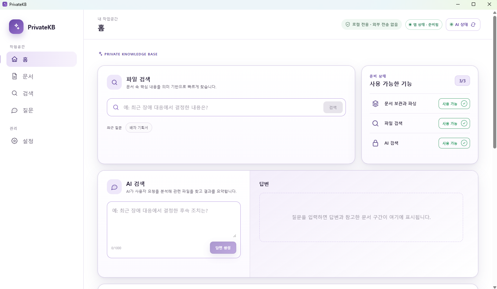

# PrivateKB

내 PC의 문서를 등록하고, 파일 내용과 자연어 질문으로 필요한 자료를 찾는 **Windows용 로컬 AI 문서 검색 앱**이다. 문서 파싱·OCR·임베딩부터 관련 파일 검색과 근거를 포함한 AI 답변까지 하나의 화면에서 사용할 수 있다.



## 주요 기능

- **문서 관리**: 파일·폴더 단위 등록, 처리 상태 확인, 최근 문서와 전체 목록 조회
- **파일 검색**: 임베딩 벡터와 본문·파일명 단서를 함께 활용하는 검색
- **AI 검색**: 질문의 의도·날짜·폴더 범위를 분석하고 관련 문서와 답변 제공
- **근거 확인**: 답변에 사용한 문서 구간 표시와 원본 파일의 `폴더에서 보기`
- **PDF OCR**: 텍스트를 추출할 수 없는 이미지형 PDF의 한국어·영어 인식
- **처리 복구**: 점진적 청크 저장, 중단 작업 재개, 동일 파일 중복 확인
- **로컬 실행**: 앱 전용 Java·PostgreSQL·pgvector·OCR 런타임을 설치 파일에 포함

## 다운로드 및 시작하기

배포 파일은 [Releases](https://github.com/gilhwankim/PrivateKB/releases)에서 확인할 수 있다. 릴리스가 아직 게시되지 않았다면 아래의 [설치 파일 빌드](#설치-파일-빌드) 절차로 생성할 수 있다.

### 실행 환경

- Windows 10/11 **x64**
- AI 기능을 사용할 경우 [Ollama](https://ollama.com/) 설치 및 실행
- 문서 저장과 선택한 AI 모델을 위한 디스크 여유 공간

설치본 사용자는 **Java, PostgreSQL, Docker, Node.js, Rust, Tesseract를 별도로 설치할 필요가 없다.**
WebView2가 없는 PC에서는 설치 과정에 다운로드가 필요할 수 있다.
Ollama와 AI 모델은 설치 파일에 포함하지 않는다.

### 첫 문서 검색

1. `PrivateKB_<버전>_x64-setup.exe`를 설치하고 앱을 실행한다.
2. Ollama를 실행한 뒤 우측 상단 **AI 상태**에서 임베딩 모델을 준비한다.
3. **문서** 메뉴의 `문서 추가` 또는 `폴더 추가`로 자료를 등록한다.
4. 문서 처리가 완료되면 **파일 검색**에서 원하는 내용을 찾는다.
5. AI 답변도 사용하려면 **설정**에서 대화 모델을 선택하고 설치한 뒤 **AI 검색**을 사용한다.

Ollama가 없어도 문서 등록·파싱은 가능하지만, 임베딩과 파일 검색에는 임베딩 모델이 필요하다.
AI 검색에는 임베딩 모델과 선택한 대화 모델이 모두 필요하다.

현재 설치 파일에는 코드 서명을 적용하지 않아 Windows 보안 경고가 나타날 수 있다.
개인 PC에서 사용하는 로컬 앱이며, 다중 사용자 인증·문서별 접근 권한을 제공하는 공유 서버용 서비스는 아니다.

## 지원 문서 및 파일 제한

| 문서 종류 | 확장자 |
| --- | --- |
| PDF | `.pdf` |
| Word | `.doc`, `.docx` |
| PowerPoint | `.ppt`, `.pptx` |
| Excel | `.xls`, `.xlsx` |
| 한글 | `.hwp` — HWP 5.x |
| 텍스트·Markdown | `.txt`, `.md`, `.markdown` |

HWP 3.x와 HWPX는 지원하지 않는다. 암호로 보호되어 본문을 읽을 수 없는 문서는 처리에 실패할 수 있다.
OCR은 PDF를 대상으로 하며 최대 20쪽, 추출 텍스트는 문서당 최대 500만 자로 제한한다.

파일당 업로드 제한은 설정에서 선택한 사양에 따라 달라진다. MB는 1,000,000바이트 기준이며,
일괄 등록에는 별도의 총량·개수 제한도 적용된다.

## AI 모델 설정

임베딩 모델은 **`qwen3-embedding:0.6b` / 1024차원**으로 고정한다.

| 설정 | 대화 모델 | 파일당 업로드 제한 |
| --- | --- | --- |
| 미사용 · 기본값 | 실행하지 않음 | 25MB |
| 저사양 | `qwen3.5:2b-q4_K_M` | 25MB |
| 일반 | `qwen3.5:4b` | 50MB |
| 고사양 | `qwen3.5:9b` | 100MB |

- 모델 선택만으로 다운로드를 시작하지 않으며, 설치 버튼에서 확인 후 진행한다.
- 대화 모델 설정을 바꿔도 기존 문서를 다시 임베딩하지 않는다.
- 설정을 낮춰도 이미 등록한 문서와 벡터는 삭제하지 않는다.
- 선택한 모델이 없을 때 다른 설치 모델로 자동 전환하지 않는다.
- GPU 없이 CPU로도 실행할 수 있지만 모델 크기와 PC 사양에 따라 처리 시간이 길어질 수 있다.

PrivateKB는 같은 PC의 Ollama에 연결한다. 기본 주소는 `http://127.0.0.1:11434`이며,
`localhost`도 허용한다. 최초 모델 다운로드에는 인터넷 연결이 필요하다.

## 기술 구성

| 영역 | 기술·역할 |
| --- | --- |
| 데스크톱 | Tauri / Rust — 창·트레이, 파일 선택, 탐색기 연결, 로컬 프로세스 관리 |
| 화면 | React / TypeScript / Vite |
| 애플리케이션 | Spring Boot / Java 21 — 문서 처리, 검색, SSE 답변 |
| 데이터베이스 | PostgreSQL 18 / pgvector 0.8.6 — 문서 메타데이터·벡터 저장 |
| 문서 추출 | Apache Tika / PDFBox / Tesseract OCR |
| 로컬 AI | Ollama — 임베딩 생성과 대화 모델 실행 |

앱은 동봉된 전용 런타임을 실행하며, PC에 별도로 설치된 Java나 PostgreSQL을 사용하는 구조가 아니다.
기본 포트가 사용 중이면 다른 로컬 포트를 선택한다. 창의 닫기 버튼은 트레이로 숨기며,
트레이에서 앱을 종료하면 관리 중인 로컬 서비스도 함께 종료한다.

## 데이터와 로그 위치

설치본의 사용자 데이터는 다음 위치에 저장한다.

```text
%LOCALAPPDATA%\io.privatekb.desktop\
├── database/    전용 PostgreSQL 데이터
├── storage/     문서 처리용 사본·추출 텍스트
├── config/      앱 설정과 전용 DB 접속 정보
└── logs/        실행 로그
```

처리가 완료되면 관리용 원본 사본은 삭제하고 추출 텍스트와 검색용 데이터를 유지한다.
사용자가 선택한 원본 파일 자체는 삭제하지 않는다.

실행 로그는 약 **10MB·UTC 날짜 기준으로 회전**하고, 보관 로그는 **7일** 후 정리한다.
전체 관리 로그가 **100MB**를 넘으면 오래된 보관 파일부터 삭제하며, 시작 시와 실행 중 1분마다 정리한다.
현재 기록 중인 파일은 보호한다. PostgreSQL의 기록 단위와 정리 주기에 따라 용량은 일시적으로 초과할 수 있다.
이 정책은 실행 로그에만 적용하며 문서 목록·DB의 처리 이력에는 적용하지 않는다.

## 소스에서 개발 실행

다음 명령은 저장소 루트의 PowerShell에서 실행한다.

### 개발 도구

- Git, JDK 21, Node.js 24
- Docker Desktop / Compose — 개발용 DB와 컨테이너 통합 테스트
- Windows 데스크톱 개발 시 Rustup, Visual Studio C++ Build Tools, Windows SDK
- AI 기능 테스트 시 Ollama와 사용할 모델

### 1. 개발용 DB

```powershell
if (-not (Test-Path .env)) { Copy-Item .env.example .env }
# .env의 PRIVATEKB_DB_PASSWORD를 개발용 비밀번호로 변경한다.
docker compose up -d database
```

이미 `.env`가 있다면 복사 단계를 건너뛴다.
이 비밀번호는 개발용 DB 초기화와 애플리케이션의 DB 접속에 사용하며 Git에 포함하지 않는다.
개발용 DB의 기본 주소는 `127.0.0.1:5433`이고, 포트는 `PRIVATEKB_DB_PORT`로 변경할 수 있다.
설치본은 이 `.env` 대신 PC에서 자동 생성한 전용 DB 비밀번호를 사용한다.

### 2. 애플리케이션 서버

```powershell
.\gradlew.bat bootRun
```

Spring Boot가 프로젝트 루트의 `.env`를 읽는다.
기본 주소는 `http://127.0.0.1:8080`이며 상태 확인 경로는 `/actuator/health`다.
개발 모드의 문서 저장 기본 경로는 `data/privatekb`다.

### 3. 화면

별도 PowerShell 창에서 실행한다.

```powershell
Set-Location frontend
npm.cmd ci
npm.cmd run dev
```

개발 화면은 `http://127.0.0.1:5173`에서 열리며 `/api` 요청을 Spring Boot로 전달한다.
네이티브 파일 선택·트레이 등 데스크톱 기능을 확인할 때는 `npm.cmd run desktop:dev`를 사용한다.
동봉 런타임의 유무에 따라 서비스 실행 방식이 달라지므로 [개발·패키징 안내](docs/development/fork-and-build.md)를 함께 참고한다.

## 테스트

저장소 루트에서 실행한다.

```powershell
# Java 단위·구조 테스트
.\gradlew.bat test

# PostgreSQL·pgvector 통합 테스트 — Docker 필요
.\gradlew.bat integrationTest

# 프런트엔드 테스트 — frontend에서 npm ci를 먼저 실행
npm.cmd --prefix frontend test

# Rust 테스트
cargo test --locked --manifest-path frontend/src-tauri/Cargo.toml
```

단위 테스트와 별도로, 설치 파일 빌드 과정에서 동봉 Java의 문서 파싱,
격리된 PostgreSQL·pgvector, 점진 색인·복구, 네이티브 연결과 로그 회전을 검증한다.
일부 로컬 문서·OCR·실행 환경 테스트는 별도 조건을 갖춘 경우에만 실행한다.

## 설치 파일 빌드

### Windows에서 직접 빌드

Node.js 24, Rustup, Visual Studio C++ Build Tools와 Windows SDK를 준비한 뒤 실행한다.

```powershell
# 개발 도구 확인
powershell.exe -NoProfile -ExecutionPolicy Bypass -File .\scripts\build-windows.ps1 -Mode Check

# 의존성 준비 → 검증 → 설치 파일 생성
powershell.exe -NoProfile -ExecutionPolicy Bypass -File .\scripts\build-windows.ps1
```

JDK·PostgreSQL·pgvector·OCR 의존성은 프로젝트 전용 경로에 다운로드하고 검증한다.
설치 파일 패키징에는 Docker가 필요하지 않다.

생성 위치:

```text
frontend/src-tauri/target/release/bundle/nsis/
  PrivateKB_<버전>_x64-setup.exe
  PrivateKB_<버전>_x64-setup.exe.sha256
  PrivateKB_<버전>_x64-setup.exe.build.json
```

### GitHub Actions에서 빌드

저장소를 fork한 뒤 **Actions → Windows 설치 파일 만들기 → Run workflow**를 실행한다.
성공한 실행의 `PrivateKB-windows-x64` 아티팩트에서 설치 파일을 받을 수 있다.
Fork만으로 빌드가 실행되지는 않으며, 아티팩트는 GitHub Releases에 자동 게시되지 않는다.

자세한 도구 버전과 절차는 [Fork·설치 파일 빌드 안내](docs/development/fork-and-build.md)에 정리되어 있다.

## 저장소 구조

| 경로 | 내용 |
| --- | --- |
| `src/main/java/io/privatekb/` | 기능별 Java 모듈 |
| `src/main/resources/db/migration/` | Flyway DB 마이그레이션 |
| `src/test/` | Java 자동화 테스트 |
| `frontend/src/` | React 화면·상태 관리·테스트 |
| `frontend/src-tauri/src/` | Rust 데스크톱 기능·런타임·로그 관리 |
| `scripts/` | 의존성 준비·검증·Windows 패키징 |
| `.github/workflows/` | GitHub Actions 빌드 |
| `docs/development/` | 공개 개발·빌드 안내 |

문서 수집 모듈 `ingestion/internal`은 다음 역할로 구분한다.

- `web`: Controller, HTTP 요청·응답과 예외 변환
- `application`: 등록·조회·재시도 조율, `command`·`view`·`port`
- `domain`: 문서 상태, 청크, 검증 정책
- `parsing` / `indexing`: 파싱·OCR / 임베딩·체크포인트·복구
- `persistence` / `config`: JDBC·SQL / 설정·실행기 구성

모듈 경계와 내부 의존 방향은 자동화 테스트로 검증한다.
